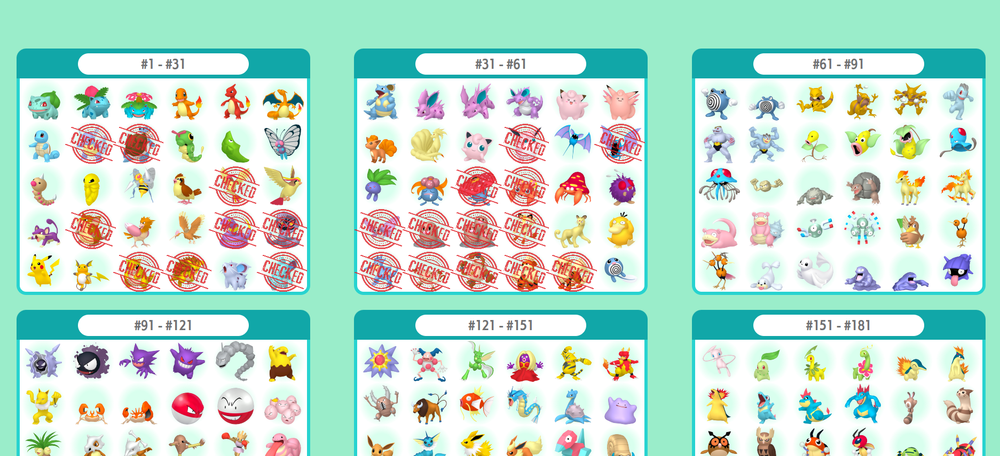

# Pokémon HOME Form Living Dex Organizer

Este projeto é uma página web desenvolvida como uma ferramenta de guia e ajuda para a organização de boxes no Pokémon
HOME. A proposta é proporcionar aos jogadores uma forma prática e intuitiva de gerenciar seu progresso na organização de
Pokémon, facilitando a visualização da progreção de suas coleções.

## Funcionalidades (Algumas esntão pendentes ainda)

- **Design Semelhante ao Pokémon HOME:** A interface tem um visual muito parecido com o próprio Pokémon HOME, oferecendo
  mais familiaridade ao organizar olhando para o site.
- **Shiny Boxes:** Opção de visualização de boxes Shiny.
- **Check e Uncheck de Pokémon:** Opções para marcar e desmarcar Pokémon, facilitando a verificação de progressão.
- **Marcação em lote:** Opções para marcar e desmarcar Boxes de Pokémon inteiras, facilitando a adaptação direta, sem o
  preenchimento manual para cada Pokémon.
- **Melhor maneira de organização:** Dicas e sugestões de como organizar suas boxes de maneira eficiente para uma form living dex, sem que seja
  necessário mover os pokémon de lugar em casos de novos lançamentos.
- **Visualização de Dados:** Porcentagens que mostram estatísticas sobre a coleção de Pokémon do usuário.
- **Compatibilidade com Dispositivos Móveis:** A página é responsiva e pode ser acessada facilmente em smartphones e
  tablets.

## Tecnologias Utilizadas

- HTML5, CSS3 e JavaScript para o front-end
- APIs do Pokémon para trazer informações em tempo real sobre Pokémon e suas características
- Dados e informações do [Serebii.net](https://www.serebii.net/pokemonhome/depositablepokemon-sorted.shtml)

## Como Contribuir

Contribuições são bem-vindas! Se você tem ideias para novas funcionalidades, correções de bugs ou melhorias na
documentação, sinta-se à vontade para abrir um pull request ou criar uma issue.

## Demonstração

Uma demonstração do visual inicial da aplicação está disponível abaixo:

